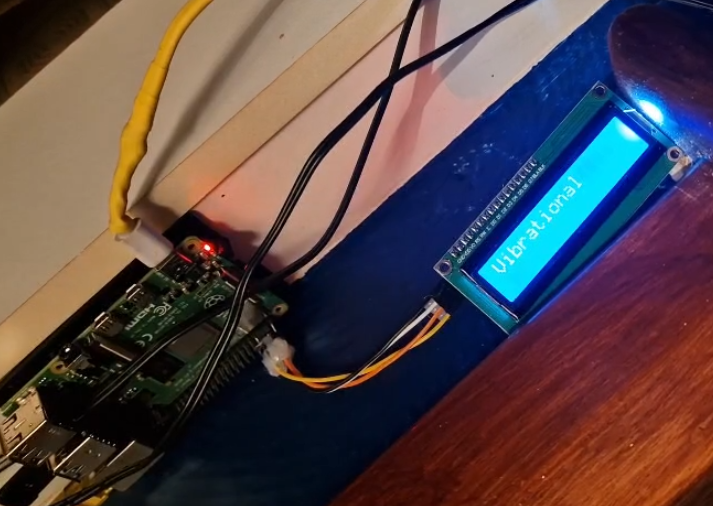

# Quick Ebook Reader

##### This script was tested using a Raspberry Pi 4 B+ running on Linux server.

## Setup

1. Wire your LCD to your board,

2. Set up the python environment. This project includes a virtual environment you can activate with `$ source venv/bin/activate`. If you can't activate it for whatever reason, remove the `/venv` directory and create your own virtual environment with `$ python3 -m venv venv_name`. Then, activate it and install dependencies with `$ pip install -r requirements.txt`,

3. Configure `CharLCD` initialization section in `read.py` (`__init__` method) to match your wiring,

4. After that, you're all set. Start `read.py` with `python3 read.py sample.pdf`.